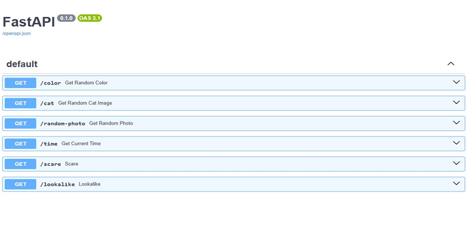

# Projeto DevOps

## Este projeto tem como objetivo ensinar na prática os conceitos de CI/CD utilizando as tecnologias FastAPI, Docker, Jenkins e Kubernetes. Os bolsistas trabalharão com um código base em FastAPI e desenvolverão uma esteira de automação que fará o deploy automatizado da aplicação em um cluster Kubernetes local.

### Fases do Projeto

### Fase 1: Preparação do projeto

Nesta fase será necessário crias as seguintes atividades:
* Criar um repositório de código no Github para inserir a aplicação de exemplo;
* Criar conta no Docker Hub.
* Verificar acesso ao cluster Kubernetes local.
* Validar execução local com uvicorn.

**Entregáveis: Código rodando localmente, repositório do github criado e ambiente preparado.**

### Passo a Passo Feito

**Instalação do Python**
```
sudo apt update 
sudo apt install python3 python3-pip -y 
python3 --version 
pip3 --version 
```

**Instalação do Git**
```
sudo apt-get install git-all 
git version 
```

**Clonar o Repositório do Projeto**
```
git clone https://github.com/box-genius/projeto-kubernetes-pb-desafio-jenkins 
cd projeto-kubernetes-pb-desafio-jenkins 
cd backend 
```

**Instalar FastAPI, Uvicorn e HTTPX**
```
pip install fastapi uvicorn --break-system-packages 
echo 'export PATH="$HOME/.local/bin:$PATH"' >> ~/.bashrc 
source ~/.bashrc 
pip install httpx --break-system-packages 
```

**Acessar os Endpoints no Navegador**
```
uvicorn main:app --reload --host 0.0.0.0 --port 8000 
http://<IP>:8000/color 
```

**Publicar o Projeto no seu Repositório do GitHub**

1. Crie um novo repositório vazio no GitHub (sem README, .gitignore, etc). 
2. Configure o Git localmente se necessário:

``` 
git config --global user.name "Seu Nome" 
git config --global user.email "seuemail@example.com" 
cd projeto-kubernetes-pb-desafio-jenkins 
git init 
git add . 
git commit -m "primeiro commit" 
git branch -M main 
git remote add origin <URL-DO-SEU-REPOSITÓRIO> git push -u origin main
``` 
3. Autenticação:  
* Vá para https://github.com/settings/tokens  
* Clique em "Generate new token (use a versão "classic", não "fine-grained")" 
* Dê um nome e selecione escopo repo. 
* Clique em "Generate token" 
* Copie o token (você não verá novamente depois) Quando for solicitado: 
* Username: seu nome de usuário GitHub.
* Password: cole o token gerado 

-----

### Fase 2: Conteinerização com Docker

Nesta fase é esperado que se execute o backend, incrementando esses códigos em containers e depois faça a publicação deste container no Dockerhub
* Para teste local e ver se está funcionando, pode criar docker-compose (opcional);
* Fazer build: docker build -t usuario/fastapi-hello:latest .
* Fazer push: docker push usuario/fastapi-hello:latest
* Versionar o dockerfile junto com o código da aplicação no github.

**Entregáveis: Imagem publicada no Docker Hub.**

### Passo a Passo Feito
**Build, Teste e Publicação da Imagem Docker**

1. Build da Imagem: 
```
docker build -t <seu usuario/nome da imagem no DockerHub>:latest . 
```

2. Testar a Imagem Localmente: 
```
docker run -d -p 8000:8000 <seu usuario/nome da imagem no DockerHub>:latest 
docker ps 
http://<IP>:8000/docs 
```




2. Publicar a Imagem no Docker Hub:
```
docker login -u <seu usuario> 
docker push <seu usuario/nome da imagem no DockerHub>:latest
``` 

-----

### Fase 3: Arquivos de Deploy no Kubernetes

Nesta fase vamos manualmente criar o deployment e service do kubernetes para que rode a imagem de container que acabamos de subir na fase anterior, no Kubernetes local.
* Criar o yaml de deployment da aplicação e aplicá-lo no cluster
* Criar o yaml de service do deploymento e aplicá-lo no cluster

**Criar o yaml de service do deploymento e aplicá-lo no cluster**

### Passo a Passo Feito
1. Preparação das Imagens

```
docker-compose up -d

docker tag backend-app:latest <seu usuario/nome da imagem no DockerHub>:v1.0.0

cd k8s/
```

2. Estrutura do Projeto
```
projeto-DevOps/
├── k8s/
│   └── deployment.yaml       
└── ...
```

3. Deployment YAML
```
apiVersion: apps/v1
kind: Deployment
metadata:
  name: fastapi-deployment
spec:
  replicas: 1
  selector:
    matchLabels:
      app: fastapi
  template:
    metadata:
      labels:
        app: fastapi
    spec:
      containers:
        - name: fastapi
          image: liciasantos/fastapi-hello
          ports:
            - containerPort: 8000
---
apiVersion: v1
kind: Service
metadata:
  name: fastapi-service
spec:
  selector:
    app: fastapi
  ports:
    - port: 80
      targetPort: 8000
      nodePort: 30001
  type: NodePort

```

4. Deploy no Kubernetes
```
kubectl apply -f deployment.yaml

kubectl get pods

kubectl get svc
```
-----

### Fase 4: Jenkins - Build e Push

Nesta fase vamos criar uma pipeline no jenkins que quando acionada, seja manualmente ou por alguma mudança no repositório do github, execute o build e o push da imagem de container.
* Criar a pipeline no Jenkins;
* Realizar o stage de build;
* Realizar o stage de push;
* Fazer assim que commitar com o git push acionar automatico a pipeline no jenkins

**Entregáveis: Pipeline funcional no Jenkins até o push da imagem.**

### Passo a Passo Feito
1. Instalação do Java (JDK 17)
```
sudo apt update && sudo apt install openjdk-17-jdk -y
```
2. Instalação do Jenkins
```
# Adicionar chave do Jenkins
sudo wget -O /usr/share/keyrings/jenkins-keyring.asc \
  https://pkg.jenkins.io/debian-stable/jenkins.io-2023.key

# Adicionar repositório
echo "deb [signed-by=/usr/share/keyrings/jenkins-keyring.asc] https://pkg.jenkins.io/debian-stable binary/" | sudo tee /etc/apt/sources.list.d/jenkins.list > /dev/null

# Instalar Jenkins
sudo apt-get update && sudo apt-get install -y jenkins
```
3. Obter Senha Inicial do Jenkins
```
sudo cat /var/lib/jenkins/secrets/initialAdminPassword
```
4. Após a instalação, acesse Jenkins pelo IP: `http://< Seu IP >:8080/`

5. Crie um arquivo Jenkinsfile na raiz do seu repositório:
```
pipeline {
    agent any

    environment {
        DOCKERHUB_REPO = "liciasantos"
        BUILD_TAG = "${env.BUILD_ID}"
    }

    stages {
        stage('Build Backend Docker Image') {
            steps {
                script {
                    backendapp = docker.build("${DOCKERHUB_REPO}/meu-backend:${BUILD_TAG}", '-f ./backend/Dockerfile ./backend')
                }
            }
        }

        stage('Push Docker Images') {
            steps {
                script {
                    docker.withRegistry('https://index.docker.io/v1/', 'dockerhub') {
                        backendapp.push('latest')
                        backendapp.push("${BUILD_TAG}")
                    }
                }
            }
        }

        stage('Deploy no Kubernetes') {
            steps {
                withKubeConfig([credentialsId: 'kubeconfig', serverUrl: 'https://192.168.15.6:6443']) {
                    script {
                        sh """
                            sed 's|{{BACKEND_TAG}}|${BUILD_TAG}|g' ./k8s/deployment.yaml > ./k8s/deployment-temp.yaml
                            kubectl apply -f ./k8s/deployment-temp.yaml
                        """
                        sh 'kubectl rollout status deployment/backend-app'
                    }
                }
            }
        }

        stage('Verificar Deploy') {
            steps {
                withKubeConfig([credentialsId: 'kubeconfig', serverUrl: 'https://192.168.15.6:6443']) {
                    sh 'kubectl get pods -l app=backend-app'
                    sh 'kubectl get services'
                }
            }
        }
    }

    post {
        always {
            chuckNorris()
        }
        success {
            echo '🚀 Deploy realizado com sucesso!'
            echo '💪 Chuck Norris aprova seu pipeline DevSecOps!'
            echo "✅ Backend: ${DOCKERHUB_REPO}/meu-backend:${BUILD_TAG} deployado"
            echo '🔧 Backend disponível em: http://localhost:30001'
        }
        failure {
            echo '❌ Build falhou, mas Chuck Norris nunca desiste!'
            echo '🔍 Chuck Norris está investigando o problema...'
        }
        unstable {
            echo '⚠️ Build instável - Chuck Norris está monitorando'
        }
    }
}
```

-----

### Fase 5: Jenkins - Deploy no Kubernetes

Nesta fase o Jenkins será configurado para acessar o kubectl e acesso ao cluster local, assim como uma etapa de deploy será incluída no pipeline.
* Jenkins precisa acessar o kubectl (usar agent com kubectl e kubeconfig configurados);
* Adicionar etapa de deploy no Jenkinsfile;
* Testar a pipeline completa;

**Entregáveis: Pipeline completo com deploy automatizado..**

### Passo a Passo Feito

1. Credenciais DockerHub
* Vá em Gerenciar Jenkins > Credenciais
* Clique em Sistema > Global credentials
* Adicione credencial do tipo Username with password
* ID: dockerhub
* Username: Seu usuário DockerHub
* Password: Sua senha DockerHub

2. Credenciais Kubernetes
* Copie o arquivo kubeconfig do seu cluster
* Adicione credencial do tipo Secret file
* ID: kubeconfig
* Faça upload do arquivo kubeconfig

3. Executando a Pipeline
* Acesse sua pipeline no Jenkins
* Clique em Build Now para execução manual

